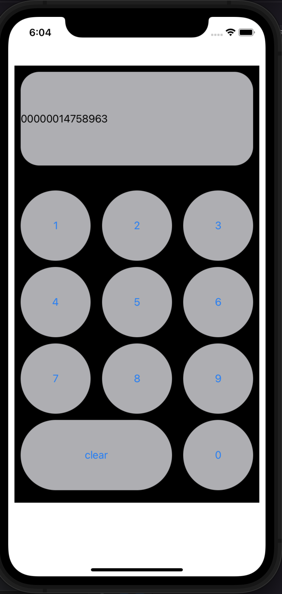

## 숫자 입력 앱  

> stackView  
> > 안드로이드에서 linearLayer와 비슷  
> > 가로/세로 방향으로 객체들을 모아서 정리  
> > Aligment로 child들의 위치 설정  
> > Distribution으로 child들이 공간을 어떻게 채울지 결정  
> > 너무 많은 stackView를 겹쳐서 사용하면 ui처리속도가 약간 느려질 수 있음

> 객체 모양  
> > 배경색이나 크기 등은 storyboard에서 설정  
> > radius는 코드로 객체의 layer.cornerRadius를 설정
> > > 화면 크기에 따라 동적으로 설계했다면 viewDidAppear 함수 호출에서 객체의 크기를 얻을 수 있음

> 버튼 클릭 이벤트  
> > IBAction으로 하나씩 할당하려다 코드가 너무 길어져서 addTarget함수를 이용  
> > @objc로 이벤트 발생시 실행할 함수를 지정한 뒤 #selector()로 할당한다.  
> > IBAction으로 버튼을 연결한 후 코드에서만 삭제하고 storyboard에서 삭제하지 않으면 완전히 지워지지 않는다는 점 주의  

> @objc func clicked(_ sender : UIButton){// code}  
> > 인자로 들어가는 변수명 앞에 '_'를 사용하면 인자 이름을 생략할 수 있음  
> > + 인자로 들어가는 변수의 타입 앞에 'inout' 키워드를 붙이면 상수로 취급되지 않고 인자로 들어온 변수의 값 자체를 바꿀 수 있음  

